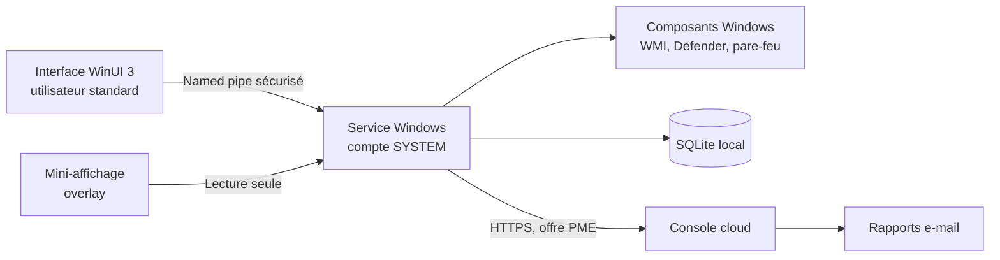
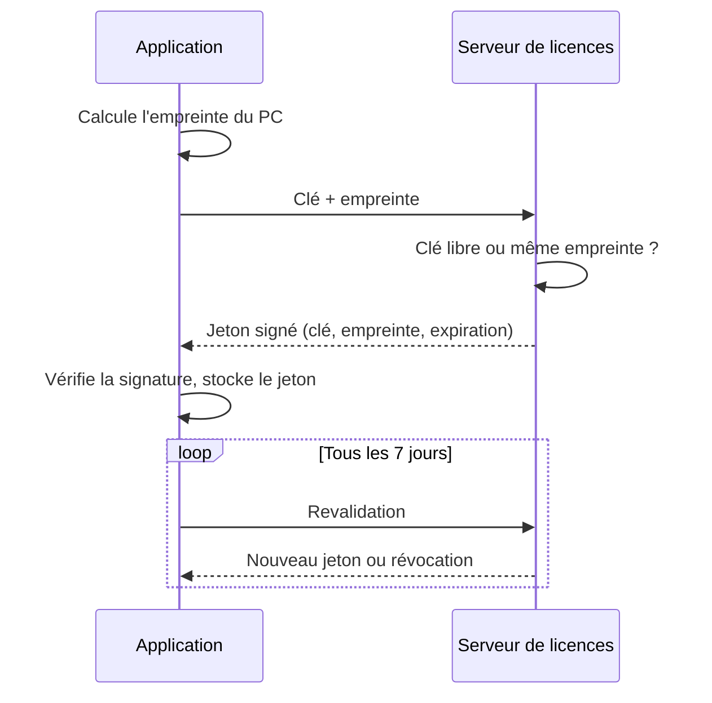

# Cahier des charges — Application Santé PC Windows

22 septembre 2026 · Othmane Yabir

## 1. Vision produit

Une application Windows qui diagnostique, sécurise et optimise un PC en un clic, sans jamais renvoyer l'utilisateur vers les Paramètres Windows. Nom commercial : à définir.

**Promesse** : « Votre PC en bonne santé, expliqué simplement, réparé en un clic. »

**Cibles**

| Cible | Besoin principal | Ce qu'elle achète |
| --- | --- | --- |
| Particuliers | PC lent, peur des virus, pas de compétences techniques | Diagnostic clair, réparation en un clic, protection |
| TPE / PME (1 à 50 postes) | Pas de service IT interne, parc hétérogène | Surveillance de tous les postes, alertes, rapports au gérant |

**Différenciation face à CCleaner, Glary, Avast Cleanup**

- Actions exécutées directement sur les composants Windows, sans redirection.
- Explications en français et en darija, avec un assistant IA.
- Mode PME avec console centrale et rapport mensuel, rare chez les outils grand public.
- Transparence totale : aucun faux problème affiché, point de restauration avant chaque changement.
- Prix adaptés au marché marocain et africain, paiement local.

## 2. Périmètre fonctionnel

Dix modules, tous pilotés depuis l'interface et exécutés par le service Windows, sans redirection vers les Paramètres.

### M1 — Tableau de bord et score de santé

- Score global de 0 à 100, avec code couleur (vert, orange, rouge).
- Quatre sous-scores : Sécurité, Performance, Stabilité, Stockage.
- Liste des problèmes détectés, chacun avec explication simple et bouton « Corriger ».
- Bouton « Tout corriger » avec récapitulatif avant exécution.

### M2 — Protection antivirus

- Pilotage de Microsoft Defender : scan rapide, complet ou personnalisé, mise à jour des signatures.
- Gestion de la quarantaine : restaurer ou supprimer.
- Historique des menaces détectées.
- Détection des antivirus tiers installés via Windows Security Center.
- Activation en un clic de la protection en temps réel, de la protection cloud et de la protection contre les ransomwares (dossiers contrôlés).
- Limite assumée : la désactivation de Defender est bloquée par Windows (protection contre les falsifications). L'application le signale clairement.

### M3 — Processus et ressources

- Liste des processus avec consommation CPU, RAM, disque et réseau.
- Historique sur 7 jours pour repérer les processus gourmands en permanence.
- Classification par base de réputation : utile, inutile, inconnu, suspect.
- Actions en un clic : arrêter, retirer du démarrage, désactiver le service associé, ouvrir l'emplacement du fichier.
- Vérification de signature numérique de chaque exécutable.

### M4 — Optimisations proposées

- Programmes au démarrage et tâches planifiées tierces.
- Services Windows non nécessaires selon le profil (bureautique, gaming, portable).
- Plan d'alimentation et effets visuels.
- Nettoyage : fichiers temporaires, cache Windows Update, corbeille, cache des navigateurs.
- Disque : TRIM pour SSD, défragmentation pour HDD, fichier d'échange.
- Réseau : vidage DNS, réinitialisation de la pile réseau.
- Point de restauration automatique avant chaque optimisation, et bouton « Annuler » par action.

### M5 — Mini-affichage temps réel

- Barre compacte toujours au premier plan, transparente et « click-through » : les clics passent au travers.
- Indicateurs : CPU, RAM, disque, réseau, température CPU/GPU, batterie.
- Position, taille, opacité et indicateurs réglables.
- Masquage automatique en plein écran (jeux, vidéos, présentations).
- Alternative : icône dans la zone de notification avec info-bulle.
- Objectif : moins de 1 % de CPU et moins de 30 Mo de RAM.

### M6 — Actions système en un clic

| Composant | Actions |
| --- | --- |
| Pare-feu | Activer / désactiver par profil (domaine, privé, public), réinitialiser les règles |
| Windows Update | Rechercher, installer, réparer une mise à jour bloquée |
| Defender | Activer les protections, lancer un scan, mettre à jour |
| BitLocker (Pro) | Vérifier l'état, activer le chiffrement, sauvegarder la clé |
| Système | SFC, DISM, point de restauration, vérification disque |
| Réseau | Vidage DNS, réinitialisation Winsock et TCP/IP |
| Compte | Vérifier les comptes administrateurs locaux, désactiver le compte Invité |

Chaque action affiche un résultat explicite : réussi, ou échec avec la raison.

### M7 — Sessions en cours

- Utilisateurs connectés localement et à distance (RDP).
- État de chaque session : active, déconnectée, verrouillée, avec heure de connexion et IP source.
- Actions : envoyer un message, déconnecter, fermer la session.
- Alerte en cas de connexion RDP inhabituelle.

### M8 — Reporting

- Historique local : score, menaces, actions réalisées, évolution des performances.
- Rapport PDF hebdomadaire ou mensuel, lisible par un non-technicien.
- Export CSV pour les PME.
- Offre PME : rapport consolidé multi-postes envoyé par e-mail au gérant.

### M9 — Tâches planifiées

- Modèles prêts à l'emploi activables en un clic : scan antivirus quotidien, nettoyage hebdomadaire, point de restauration hebdomadaire, vérification des mises à jour, rapport mensuel.
- Choix du jour, de l'heure et de la condition (PC inactif, sur secteur).
- Journal d'exécution de chaque tâche.

### M10 — Assistant IA

- Explication des problèmes détectés en français, darija ou anglais.
- Analyse des erreurs système (BSOD, plantages) avec recommandation.
- L'assistant propose, l'utilisateur valide : aucune action automatique décidée par l'IA.

## 3. Architecture technique

L'application repose sur un service Windows en compte SYSTEM qui exécute les actions, piloté par une interface utilisateur sans privilèges. C'est ce qui permet d'agir en un clic sans fenêtre UAC à chaque action.

L'interface et le mini-affichage ne font qu'envoyer des demandes ; seul le service touche au système.

### Composants

| Composant | Technologie | Rôle |
| --- | --- | --- |
| Service | C# .NET 8, Worker Service | Collecte, actions système, planification |
| Interface | WinUI 3 (ou WPF) | Tableau de bord, modules, paramètres |
| Mini-affichage | Fenêtre WPF/Win32 superposée | Indicateurs temps réel |
| Stockage local | SQLite | Historique, journal, configuration |
| Console PME | ASP.NET Core + PostgreSQL + front React | Multi-postes, alertes, rapports |
| Installeur | MSIX ou WiX (MSI) signé | Installation, mises à jour |
| Rapports | QuestPDF | Génération PDF |

### API Windows utilisées

| Besoin | Moyen technique |
| --- | --- |
| Métriques matériel | WMI/CIM, compteurs de performance, LibreHardwareMonitor pour les températures |
| Defender | Module Defender (MSFT_MpComputerStatus, MpCmdRun) |
| Antivirus tiers | WMI root\SecurityCenter2 |
| Pare-feu | API COM INetFwPolicy2 ou module NetSecurity |
| Windows Update | API Windows Update Agent (WUApiLib) |
| Sessions | WTSEnumerateSessions (API Terminal Services) |
| Démarrage | Clés Run du registre, dossier Démarrage, Planificateur de tâches |
| Tâches planifiées | Bibliothèque TaskScheduler (.NET) |
| Journaux et crashs | Event Log, dossier Minidump |
| Restauration | Checkpoint-Computer / SystemRestore WMI |
| Overlay click-through | Styles WS_EX_LAYERED, WS_EX_TRANSPARENT, WS_EX_TOPMOST, WS_EX_TOOLWINDOW |

### Assistant IA

- Appel à un LLM via API, côté cloud, avec envoi minimal de données (codes d'erreur, métriques, jamais de fichiers personnels).
- Option future : petit modèle local pour un fonctionnement hors ligne.

### Compatibilité

- Windows 10 (22H2) et Windows 11, 64 bits.
- Éditions Home et Pro : détection de l'édition et masquage des fonctions indisponibles (BitLocker, stratégies de groupe).

## 4. Écrans de l'application

Navigation latérale à gauche, neuf écrans principaux, interface en français, arabe et anglais.

| Écran | Contenu principal | Actions clés |
| --- | --- | --- |
| Accueil | Score de santé, 4 sous-scores, problèmes détectés | Tout corriger, analyser maintenant |
| Protection | État Defender, pare-feu, antivirus tiers, dernières menaces | Scan, mise à jour, activer une protection |
| Performance | Graphiques temps réel CPU, RAM, disque, réseau, températures | Afficher le mini-affichage |
| Processus | Liste triable avec consommation et réputation | Arrêter, retirer du démarrage, désactiver |
| Optimisation | Recommandations classées par impact | Appliquer, annuler, tout appliquer |
| Système | Actions en un clic par composant (M6) | Activer, réparer, réinitialiser |
| Sessions | Sessions locales et RDP | Message, déconnecter, fermer |
| Rapports | Historique, graphiques d'évolution | Générer PDF, exporter CSV |
| Planification | Modèles de tâches et journal | Activer, modifier l'horaire |

Écrans transverses : Paramètres (langue, thème, mini-affichage, notifications), Licence (activation, offre), Assistant IA (panneau latéral accessible partout).

**Console cloud PME** : liste des postes avec score, carte des alertes, détail d'un poste, rapports consolidés, gestion des licences et des utilisateurs.

## 5. Sécurité et exigences non fonctionnelles

Un service qui tourne en SYSTEM est une cible pour les malwares : sa sécurité est la première exigence du produit.

### Sécurité du service

- Liste fermée de commandes : le service refuse toute commande hors catalogue, aucun script arbitraire.
- Named pipe protégé par ACL, n'acceptant que les processus signés de l'application.
- Vérification de la signature de l'interface avant chaque connexion.
- Scripts PowerShell internes signés, exécutés en mode contraint.
- Journal d'audit horodaté de chaque action (qui, quoi, quand, résultat).
- Mises à jour signées et vérifiées avant installation.

### Signature et réputation

- Certificat de signature de code OV au lancement (environ 200 $/an), EV à envisager ensuite.
- Soumission des binaires à Microsoft et aux principaux éditeurs antivirus pour éviter les faux positifs.
- Aucune pratique classée PUP : pas de faux problèmes, pas de logiciel tiers groupé, désinstallation propre.

### Données personnelles

- Aucune donnée personnelle collectée en offre particulier, hors licence.
- Offre PME : métriques techniques uniquement, hébergement à préciser, conformité à la loi marocaine 09-08 (CNDP).
- Consentement explicite pour l'envoi de données à l'assistant IA.

### Exigences non fonctionnelles

| Exigence | Cible |
| --- | --- |
| CPU du service au repos | < 1 % |
| RAM du service | < 80 Mo |
| RAM du mini-affichage | < 30 Mo |
| Temps d'analyse complète | < 60 s |
| Démarrage de l'interface | < 2 s |
| Taille de l'installeur | < 50 Mo |
| Annulation d'une optimisation | 100 % des actions réversibles ou précédées d'un point de restauration |

## 6. Offres et modèle de prix

Modèle freemium pour attirer les particuliers, abonnement par poste pour les PME. Prix indicatifs, à valider par une étude de marché.

| Offre | Cible | Contenu | Prix indicatif |
| --- | --- | --- | --- |
| Gratuit | Particulier | Score de santé, diagnostic, mini-affichage | 0 DH |
| Premium | Particulier | Toutes les actions en un clic, optimisation, planification, rapports, assistant IA — 1 PC | 150 à 250 DH/an |
| Famille | Particulier | Premium sur 3 PC | 300 à 400 DH/an |
| PME | Entreprise | Premium + console cloud, alertes e-mail, rapport consolidé | 30 à 50 DH/poste/mois |
| Service | PME | Intervention à distance par un technicien | Au forfait |

**Leviers de revenus complémentaires** : revendeurs informatiques (commission), pack pour boutiques de réparation PC, offre marque blanche pour prestataires IT.

**Paiement** : carte bancaire marocaine (CMI), virement pour les PME, clé de licence vendue en boutique. Paiement international à prévoir pour l'export.

## 7. Périmètre MVP et planning

Le MVP cible les particuliers et se livre en 12 semaines avec 1 à 2 développeurs .NET. La console PME arrive en V2.

### Contenu par version

| Module | MVP | V2 | V3 |
| --- | --- | --- | --- |
| M1 Tableau de bord et score | Oui | | |
| M2 Antivirus (pilotage Defender) | Oui | Antivirus tiers | |
| M3 Processus et ressources | Oui | Base de réputation enrichie | |
| M4 Optimisations | Démarrage, nettoyage, alimentation | Profils, services, réseau | |
| M5 Mini-affichage | Oui | Températures GPU | |
| M6 Actions en un clic | Pare-feu, Defender, Update, SFC/DISM, restauration | BitLocker, réseau, comptes | |
| M7 Sessions | | Oui | |
| M8 Reporting | PDF local | Rapport PME consolidé | |
| M9 Tâches planifiées | 3 modèles | Tous les modèles | |
| M10 Assistant IA | | Oui | Modèle local |
| Console cloud PME | | Oui | Marque blanche |

### Planning MVP (12 semaines)

| Semaines | Lot | Livrable |
| --- | --- | --- |
| 1–2 | Fondations | Service Windows, named pipe sécurisé, SQLite, squelette de l'interface |
| 3–4 | Diagnostic | Collecte des métriques, score de santé, écran Accueil |
| 5–6 | Protection et système | Pilotage Defender, pare-feu, Windows Update, SFC/DISM |
| 7–8 | Performance | Processus, optimisations avec restauration, mini-affichage |
| 9 | Planification et rapports | 3 tâches planifiées, rapport PDF |
| 10 | Licence et installeur | Activation par clé, installeur signé, mises à jour |
| 11 | Tests | Tests sur 20 PC réels (Home/Pro, Win 10/11), corrections |
| 12 | Lancement | Bêta publique, site de vente, soumission antivirus |

### Décisions à prendre

- [ ] Nom commercial et marque
- [ ] WinUI 3 ou WPF pour l'interface
- [ ] Développement interne ou sous-traité
- [ ] Fournisseur du certificat de signature
- [ ] Hébergement de la console PME (Maroc ou Europe)

## 8. Risques et points d'attention

Le risque principal n'est pas technique : c'est d'être classé comme logiciel indésirable ou bloqué par les antivirus.

| Risque | Impact | Parade |
| --- | --- | --- |
| Détection en faux positif par les antivirus | Installation bloquée, ventes perdues | Signature de code, soumission préalable aux éditeurs, aucun comportement suspect |
| Blocage SmartScreen au téléchargement | Taux de conversion faible | Certificat de signature, réputation construite pendant la bêta |
| Optimisation qui casse un PC | Support coûteux, image dégradée | Point de restauration systématique, annulation par action, liste d'optimisations prudente |
| Service SYSTEM exploité par un malware | Faille de sécurité grave | Liste fermée de commandes, ACL, vérification de signature, audit de sécurité avant lancement |
| Changements Windows (mises à jour majeures) | Fonctions qui cessent de marcher | Tests sur les versions Insider, veille technique |
| Concurrence gratuite (Defender, outils intégrés) | Faible disposition à payer | Valeur sur la simplicité, l'explication en français/darija et l'offre PME |
| Limites volontaires de Windows | Promesse non tenue | Afficher clairement ce que Windows interdit (ex. désactiver Defender) |

## 9. Mode d'exécution autonome (instructions pour Claude Code)

Claude Code développe l'application complète (MVP, sections 2 à 8) de bout en bout, sans solliciter le commanditaire avant la fin du chantier. Ce cahier des charges est la seule source de vérité.

### Mission

- Livrer une application fonctionnelle, compilée, testée et packagée, conforme au périmètre MVP de la section 7.
- Livrer aussi le serveur de licences (section 12), indispensable au fonctionnement.
- Ne revenir vers le commanditaire qu'une fois le chantier terminé, avec le rapport final (section 13).

### Règles de travail

1. Lire tout le cahier des charges avant d'écrire la moindre ligne de code.
2. Créer un fichier `PLAN.md` : lots, ordre de réalisation, critères de fin de chaque lot. Le tenir à jour.
3. Créer un fichier `DECISIONS.md` : chaque décision prise seul, avec la date, l'option retenue et la raison, en une ligne.
4. Avancer lot par lot, dans l'ordre du planning de la section 7. Un lot n'est terminé que s'il compile et que ses tests passent.
5. Faire un commit Git à la fin de chaque étape cohérente, avec un message clair en français.
6. En cas de blocage technique : essayer au moins deux approches, puis contourner, documenter dans `DECISIONS.md` et continuer. Ne jamais s'arrêter pour attendre une réponse.
7. Une fonction impossible à réaliser proprement est désactivée dans l'interface, signalée dans le rapport final, et le chantier continue.
8. Ne jamais ajouter de fonctionnalité hors cahier des charges.
9. Ne jamais réduire la sécurité (section 5) pour gagner du temps.

### Actions interdites sans accord

- Dépenser de l'argent ou souscrire un service payant.
- Publier quoi que ce soit en ligne (dépôt public, site, store).
- Modifier la configuration de la machine de développement au-delà de l'installation des outils de développement.
- Exécuter les optimisations et actions système destructives sur la machine hôte : les tester uniquement dans une machine virtuelle ou un environnement isolé.

## 10. Décisions tranchées et règle d'arbitrage

Les décisions ouvertes de la section 7 sont tranchées ci-dessous pour que Claude Code n'ait pas à attendre. Le commanditaire pourra les revoir après livraison.

### Décisions par défaut

| Sujet | Décision |
| --- | --- |
| Nom de l'application | Nom provisoire « PC Santé », centralisé dans un seul fichier de configuration pour être changé facilement |
| Interface | WPF sur .NET 8, avec la bibliothèque WPF-UI (style Windows 11) |
| Langues | Français par défaut, anglais et arabe ; textes dans des fichiers de ressources, aucun texte en dur |
| Base locale | SQLite via Entity Framework Core |
| Serveur de licences | ASP.NET Core Minimal API + SQLite, déployable ensuite sur PostgreSQL |
| Installeur | WiX Toolset (MSI), prêt pour la signature |
| Rapports PDF | QuestPDF (licence Community) |
| Journalisation | Serilog, fichiers tournants |
| Tests | xUnit + FluentAssertions |
| Assistant IA | Hors MVP : prévoir seulement l'interface de code (abstraction), sans implémentation |
| Console PME | Hors MVP |

### Règle d'arbitrage (dans cet ordre)

1. Ce qu'écrit explicitement le cahier des charges.
2. La sécurité de l'utilisateur et de son PC.
3. La simplicité pour un non-informaticien (section 11).
4. La fiabilité : la solution la plus éprouvée et la mieux documentée.
5. Le délai : la solution la plus rapide à livrer correctement.

En cas de doute sur une action système : choisir l'option la plus prudente et réversible.

## 11. Expérience utilisateur pour non-informaticiens

L'utilisateur type ne connaît ni les processus, ni les services, ni le pare-feu. Chaque écran doit être compris en 5 secondes sans aide.

### Règles d'interface

- Un seul bouton principal par écran, grand et coloré (ex. « Analyser mon PC », « Tout corriger »).
- Vocabulaire simple : « Protection contre les intrusions » plutôt que « Pare-feu », avec le terme technique en petit dessous.
- Chaque problème affiché suit le même format : ce qui ne va pas, pourquoi c'est important, bouton « Corriger ».
- Code couleur constant : vert = tout va bien, orange = à surveiller, rouge = à corriger.
- Aucun code d'erreur brut affiché : message clair et action proposée. Le détail technique reste accessible dans un lien « Détails ».
- Confirmation avant toute action qui ferme un programme, redémarre le PC ou supprime des fichiers.
- Après chaque action : message de résultat clair (« Protection activée »), jamais un simple silence.

### Deux niveaux d'affichage

- **Mode Simple (par défaut)** : Accueil, Protection, Nettoyage, Rapports. Les écrans Processus, Sessions et Planification avancée sont masqués.
- **Mode Avancé** : activable dans les Paramètres, il affiche tous les écrans de la section 4.

### Premier lancement

1. Écran de bienvenue en 3 étapes maximum : langue, activation de la licence, première analyse.
2. Première analyse lancée automatiquement, résultat affiché avec le score.
3. Proposition d'activer 3 tâches planifiées recommandées, en un seul clic.

### Accessibilité

- Texte d'au moins 14 px, contraste élevé, thème clair et sombre.
- Navigation complète au clavier, compatible lecteur d'écran (Narrateur Windows).
- Interface arabe en affichage de droite à gauche.

### Critère de validation

Une personne sans compétence informatique doit pouvoir, sans aide : installer, activer la licence, lancer une analyse, corriger les problèmes et générer un rapport, en moins de 5 minutes.

## 12. Licence : une clé, un seul PC

Chaque clé de licence est liée à l'empreinte matérielle d'un seul PC, vérifiée par un serveur de licences. Une clé déjà activée ailleurs est refusée.

L'application ne fait jamais confiance à elle-même : seul un jeton signé par le serveur débloque les fonctions Premium.

### Empreinte matérielle

- Combinaison hachée (SHA-256) de : identifiant de la carte mère, numéro de série du disque système, identifiant du processeur, MachineGuid de Windows.
- Tolérance : l'empreinte reste valide si 3 éléments sur 4 correspondent, pour ne pas bloquer un client qui change un disque.
- Aucune donnée matérielle brute envoyée : uniquement le hachage.

### Règles d'activation

| Situation | Comportement |
| --- | --- |
| Clé neuve | Activée et liée à ce PC |
| Même clé, même PC (réinstallation) | Réactivée sans compter une nouvelle activation |
| Même clé, autre PC | Refusée avec message : « Cette licence est déjà utilisée sur un autre ordinateur » |
| Changement de PC légitime | Bouton « Transférer ma licence » : désactive l'ancien PC, active le nouveau. Limité à 2 transferts par an |
| Offre Famille ou PME | Une clé avec N postes ; chaque poste consomme une place |
| Clé expirée ou révoquée | Retour automatique à l'offre Gratuite, sans perte de données |

### Protection du jeton

- Jeton signé par le serveur avec une clé privée Ed25519 ; l'application ne contient que la clé publique.
- Jeton stocké chiffré avec DPAPI (niveau machine), inutilisable s'il est copié sur un autre PC.
- Fonctionnement hors ligne toléré 14 jours ; au-delà, retour à l'offre Gratuite jusqu'à la prochaine connexion.
- Contrôle de l'horloge : un recul de la date système est détecté et bloque le jeton.
- Binaire obfusqué (ex. ConfuserEx ou équivalent open source) pour compliquer le contournement.

### Serveur de licences (à livrer)

- API : activer, revalider, transférer, désactiver.
- Interface d'administration minimale : générer des clés, voir les activations, révoquer une clé, remettre à zéro un transfert.
- Limitation du nombre de requêtes par IP et journal des tentatives d'activation refusées.
- Aucune clé privée dans le dépôt Git : lecture depuis une variable d'environnement.

Aucun système n'est inviolable : l'objectif est de rendre le partage de clé impossible pour un utilisateur normal et coûteux pour un utilisateur averti.

## 13. Structure du dépôt, tests et définition de « terminé »

Le chantier est terminé quand tous les critères de la liste finale sont cochés et que le rapport final est rédigé.

### Structure du dépôt

| Dossier | Contenu |
| --- | --- |
| `src/PcSante.Core` | Modèles, calcul du score, règles métier, abstractions |
| `src/PcSante.Service` | Service Windows SYSTEM, catalogue de commandes, planificateur |
| `src/PcSante.WindowsApi` | Accès WMI, Defender, pare-feu, Windows Update, sessions, registre |
| `src/PcSante.Ipc` | Contrat et sécurité du named pipe |
| `src/PcSante.App` | Interface WPF |
| `src/PcSante.Overlay` | Mini-affichage |
| `src/PcSante.Licensing` | Empreinte, jeton, vérification côté client |
| `server/PcSante.LicenseServer` | Serveur de licences et administration |
| `installer/` | Projet WiX |
| `tests/` | Tests unitaires et d'intégration par projet |
| `docs/` | PLAN.md, DECISIONS.md, guide utilisateur, guide de déploiement |

### Exigences de code

- Chaque accès à Windows passe par une interface, pour pouvoir être simulé dans les tests.
- Toute action système suit le même cycle : vérifier, sauvegarder ou créer un point de restauration, exécuter, contrôler le résultat, journaliser.
- Zéro avertissement de compilation, analyseurs .NET activés.
- Aucun secret dans le code.

### Tests attendus

- Tests unitaires : score de santé, règles de licence, catalogue de commandes, empreinte matérielle.
- Tests d'intégration du serveur de licences : activation, refus sur un 2e PC, transfert, hors ligne, révocation.
- Tests de sécurité : commande hors catalogue refusée, client non signé refusé par le named pipe.
- Couverture minimale de 70 % sur Core, Licensing et le serveur de licences.
- Actions système réelles : testées uniquement en machine virtuelle, avec une checklist de tests manuels livrée dans `docs/`.

### Définition de « terminé »

- [ ] Toute la solution compile en Release sans erreur ni avertissement
- [ ] Tous les tests automatisés passent
- [ ] Chaque module MVP de la section 7 fonctionne ou est désactivé et justifié
- [ ] Une licence activée sur un PC est refusée sur un second
- [ ] L'installeur MSI installe, met à jour et désinstalle proprement
- [ ] Service au repos sous 1 % de CPU, mini-affichage sous 30 Mo de RAM
- [ ] Interface disponible en français, anglais et arabe
- [ ] Guide utilisateur et guide de déploiement rédigés

### Rapport final

Fichier `docs/RAPPORT_FINAL.md` remis au commanditaire à la fin du chantier :

1. Ce qui est livré et fonctionne.
2. Ce qui est désactivé ou incomplet, avec la raison.
3. Les décisions prises seul (résumé de `DECISIONS.md`).
4. Les actions restant à faire par le commanditaire : signature, hébergement du serveur, tests sur PC réels.
5. Les commandes pour compiler, lancer les tests et produire l'installeur.

## 14. Prérequis avant de lancer Claude Code

Claude Code doit tourner sur une machine Windows : les API système ne peuvent être ni compilées ni testées correctement sous Linux ou macOS.

### Environnement à préparer

- [ ] PC ou VM Windows 11 Pro dédié au développement, 16 Go de RAM minimum
- [ ] .NET 8 SDK, Git, WiX Toolset installés (ou autoriser Claude Code à les installer)
- [ ] Une seconde VM Windows 11 (et idéalement Windows 10) avec instantanés, pour tester les actions système sans risque
- [ ] Dépôt Git privé créé, avec ce cahier des charges placé à la racine sous `docs/CAHIER_DES_CHARGES.md`
- [ ] Fichier `CLAUDE.md` à la racine qui renvoie vers le cahier des charges et reprend les règles de la section 9
- [ ] Mode d'autorisation de Claude Code réglé pour exécuter les commandes sans validation à chaque étape, limité au dossier du projet

### Ce que Claude Code ne pourra pas faire seul

| Élément | Qui s'en charge | Quand |
| --- | --- | --- |
| Achat du certificat de signature de code | Commanditaire | Avant la bêta publique |
| Hébergement du serveur de licences (VPS + domaine) | Commanditaire | Avant la bêta publique |
| Tests sur PC réels variés (20 postes) | Commanditaire | Après livraison |
| Soumission aux éditeurs antivirus | Commanditaire | Après signature |
| Nom commercial définitif et logo | Commanditaire | Avant la bêta publique |

### Instruction de lancement

Message à donner à Claude Code au démarrage :

> Lis entièrement `docs/CAHIER_DES_CHARGES.md`. Développe l'application complète et le serveur de licences selon ce document, en suivant strictement la section 9. Tranche seul toute question selon la section 10. Ne me sollicite pas avant la fin. Termine par `docs/RAPPORT_FINAL.md`.

Un chantier de cette taille dépasse une seule session : prévoir de relancer Claude Code avec « Reprends le chantier à partir de PLAN.md » si une session s'interrompt.
